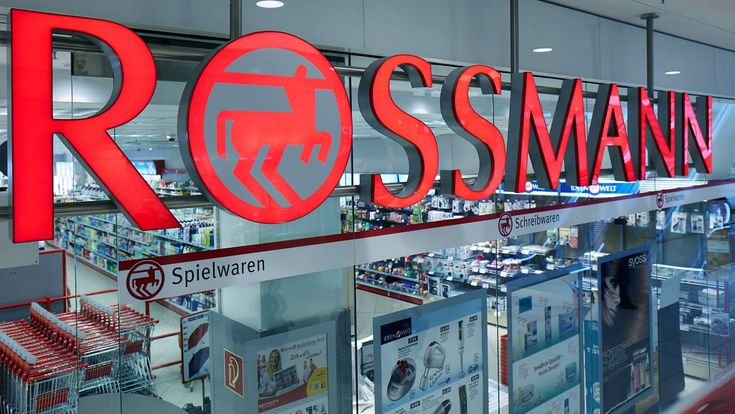
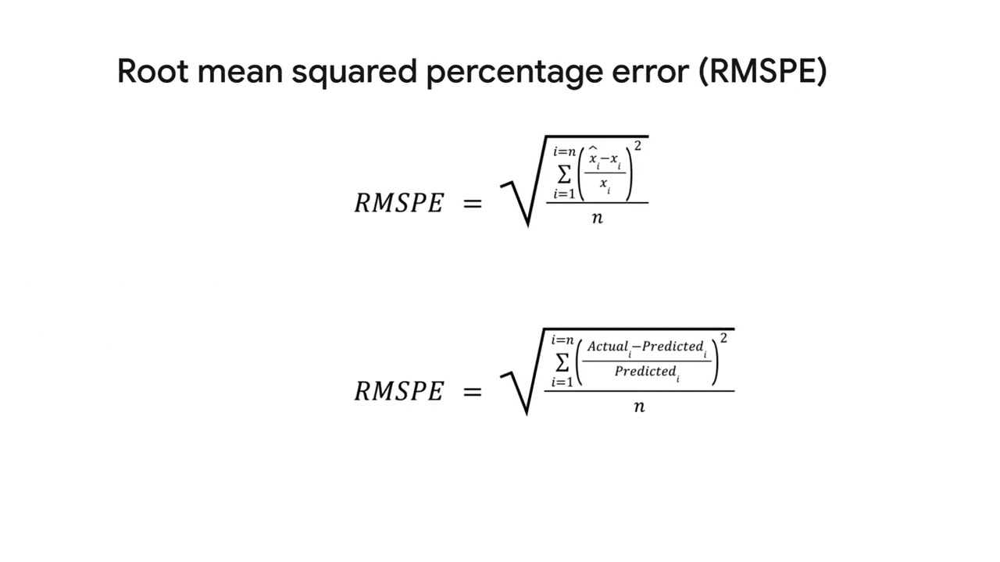

# 🌟 Rossmann Store Sales Forecasting 📈



## 📝 Project Overview
This project focuses on **predicting daily sales** for Rossmann stores over a six-week period. Using historical sales data from 1,115 stores, the goal is to build an accurate forecasting model that enables store managers to optimize staffing and inventory.

**Motivation**: Accurate sales forecasts help Rossmann's store managers improve productivity, reduce waste, and better serve customers.

## 🗂️ Project Structure
- **`train.csv`** - Historical data with sales figures.
- **`test.csv`** - Test data without sales, for making predictions.
- **`store.csv`** - Metadata about stores (type, assortment, competition, etc.).
- **`sample_submission.csv`** - Sample file in the required submission format.
- **`notebook.ipynb`** - Jupyter Notebook with data analysis, modeling, and evaluation.
- **`submission.csv`** - Final predictions for submission.

## 🛠️ Project Workflow
1. **Data Loading and Merging**: Combine `train`, `test`, and `store` datasets.
2. **Data Preprocessing**: Handle missing values, convert date columns, and extract key features.
3. **Feature Engineering**: Generate additional features like `Year`, `Month`, `Promo2Active`, etc.
4. **Modeling**: Train models (e.g., Gradient Boosting, CatBoost) using RMSPE as the evaluation metric.
5. **Evaluation and Submission**: Evaluate models, save predictions, and submit.

## 📊 Evaluation Metric: RMSPE
The **Root Mean Squared Percentage Error (RMSPE)** is used to assess model accuracy. This metric is crucial as it prioritizes relative accuracy, focusing on days with non-zero sales.



---

## 🚀 Getting Started

1. **Clone the Repository**:
   ```bash
   git clone https://github.com/your-username/rossmann-store-sales.git
   cd rossmann-store-sales
